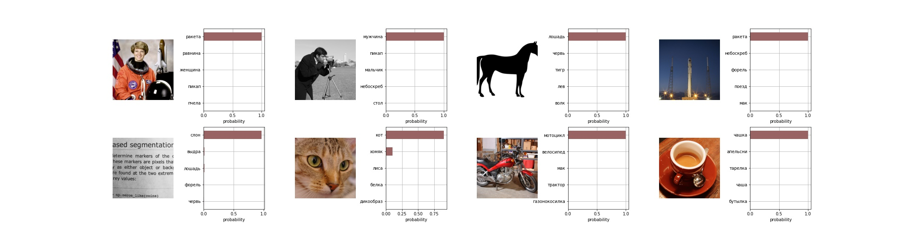
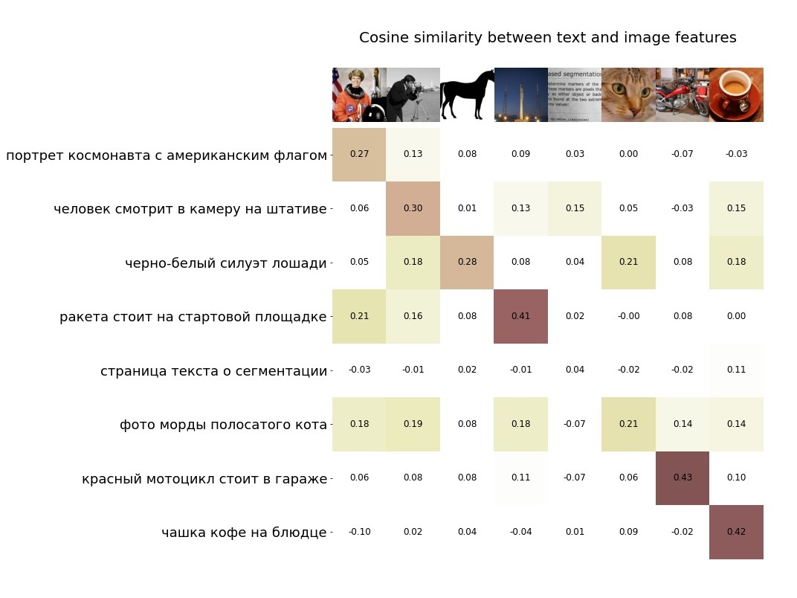
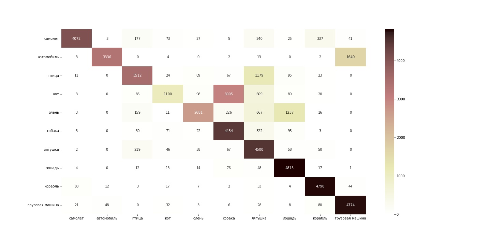

## О чем репозиторий
### В этом репозитории представлен способ файтюнить оригинальный CLIP на новый язык

~~Почему модель не видит женщину и откуда на картинке с текстом слон?~~
#### Основные особенности:
- Используются оригинальные картиночные и текстовые трансформеры;
- Поэтому есть возможность использовать оригинальные эмбединги картинок, а тексты обучать или дообучать на требуемый язык.

#### Что ожидалось?
- [ ] Для обучения трансформера русскому языку будет достаточно 3.7 млн пар картинка-текст;
- [x] Будет использована вся сила исходных картиночных эмбедингов, обученных на сотнях миллионов пар картинка-текст;
- [x] Сохранится скорость и качество работы алгоритма.

#### Что не получилось?
- Модель выучила русский, но не так хорошо, как ожидалось. Видно, что она многое не понимает. Газель для нее - это машина, а не животное. А метроном и минарет для неё вообще неизвестны;
- 3.7 млн пар мало для полноценного обучения текстового трансформера для нового языка, не хватает охвата понятий;

#### Как улучшить?
- Больше и разнообразнее данных;
- Заменить текстовый трансформер на уже предобученную языковую модель нужного языка.

### Какие репозитории использовались?
- Код для файнтюна отсюда: https://github.com/mlfoundations/open_clip
- Оригинальный клип: https://github.com/openai/CLIP
- bpe словарь: https://huggingface.co/facebook/wmt19-ru-en/tree/main/ [merges.txt]

## Детали

#### Веса обученной модели можно скачать [по ссылке](https://drive.google.com/file/d/1Pxk31gAZI7hkkeuJSMl8IMPv3heVc_-_). Код инференса есть в [скрипте testing.py](./src/testing/testing.py)

### Датасет 
Датасет взят с [соревнования Yandex Cup 2021](https://yandex.ru/cup/ml/analysis/#CV), но правилами запрещается использовать его вне соревнования. 

Всего там было 5.5 млн картинок, к каждой шло 5 поисковых запросов, после которых люди выбрали эту картинку.

Вместо картинок были ссылки на картинки, мне удалось скачать только 3.7 млн.

### Токенайзер для русского языка (и любого другого)

У меня достаточно ограниченный опыт в NLP, поэтому большую часть проблем вызвала именно языковая часть.
Я не очень понимала, какой подход может заработать, а какой нет, поэтому остановилась просто на рабочем, если кто-то подскажет, как надо было делать правильно - прошу в личные сообщения :)

В итоге я сделала так: 
- Переписала оригинальный токенайзер так, чтобы он умел в английские буквы и русские;
- Пришлось убрать обработку utf символов, так как русские слова тогда мапились в набор букв, а не в слово. Никак иначе не удавалось разобраться с этой проблемой;
- Оставила английские bpe пары, так как в датасете встречались английские слова;
- Добавила русские bpe пары, нашла файл только у переводчика от фейсбука, но пришлось почистить от дублей.

### Трансформер для картинок
Оригинальный ViT-B/32 с замороженными весами.

### Обучение
- Подгружала веса оригинального клипа;
- Замораживала картиночный трансформер;
- Текстовый трансформер переопределяла с новым размером словаря;
- Дальше стандартное обучение clip, где картиночные эмбединги не меняются, а текстовые учатся с нуля;
- Всего было 30 эпох, на одну эпоху уходило 70-90 минут, всего около 40 часов на A100 80gb c amp.

### Ресурсы
Обучение производилось на платформе [Yandex Datasphere](https://cloud.yandex.ru/services/datasphere), по сути - это jupyter lab/notebooks с урезанным bash функционалом, но очень сильными машинками.

Jupyter наложи свой отпечаток, в коде остались ноутбуковские артефакты - например, вынесение аргументов в класс в скрипте, а не передача через командную строку.

К сожалению, у меня не было возможности отладить код на обычном сервере или компьютере, так как ноут слабый, всё падало при загрузке модели.

Но код в том виде, что есть, работает запуском скрипта main.py (если его импортировать в ноутбук, хехе)

## Результаты 

Метрики по нескольким датасетам можно посмотреть ниже. А сейчас хотелось бы обсудить особенности обученной модели.

- В целом, результаты неплохие и все кроме одной картинки имеют наибольшую корреляцию с подходящим текстом, а с остальными маленькую;
- Но про фото текста модель, увы, не знает ничего, получается, в датасете не было достаточного количества подобных данных;
- Ракета угадывается на нескольких фото, хотя один раз, вероятно, это не она, что тоже нормально;
- Самое забавное с фото кота, потому что в надписи присутствует слово фото - и модель, напомню, обученная на поисковых запросах, хорошо знает что такое фото. Для силуэта лошади и текста она выдает низкие корреляции. Силуэт - это рисунок, а про текст она ничего не знает. Если заменить фразу "фото морды полосатого кота" на "морда полосатого кота", то эти корреляции уходят.

Если посмотреть на картинку в начале страницы, то там у модели самые большие проблемы опять с текстом... и с женщиной. Модель видит ракету, почему-то равнину и только потом женщину.

В [репозитории](https://github.com/sberbank-ai/ru-clip/blob/main/clip/evaluate/utils.py) и [блоге Сбера](https://habr.com/ru/company/sberdevices/blog/564440/), откуда я взяла код для этих двух визуализаций, с женщиной всё в порядке. А текст тоже имеет неверные корреляции.

Еще одна картинка с матрицей ошибок по датасету cifar10. Для остальных датасетов визуализации можно найти в [папке pics](./pics).

Самым проблемным оказался кот и совершенно не ясно почему! Остальные недопонимания достаточно понятны, а с котом нет.

## Результаты - метрики

Сравнительная табличка результатов работы нескольких алгоритмов, метрика accuracy потому что у Сбера и OpenAI она уже посчитана.

У моей модели и сберовской язык русский (и мы классы могли немного по-разному перевести).

Для OpenAI язык английский, данные из статьи.

| Датасет | Cifar10 | Cifar100 | Caltech101 | Размер датасета для обучения | Время обучения |
|:---:|:---:|:---:|:---:|:---:|:---:|
|CLIP Russian (моя модель)|76%|32%|54%|3.7 млн картинок и 5 поисковых запросов к каждой| ~40 часов на А100 80gb |
|Sber ruCLIP* |78%|41%|-|Предобученная [RuGPT3Small](https://github.com/sberbank-ai/ru-gpts) и 3 млн пар| 5 дней на 16 Tesla GPU  V100 |
|OpenAi CLIP**|95%|80%|93%|400 million (image, text) pairs collected from the internet|12 days on 256 V100 GPUs***|

* \* [Блогпост о ruCLIP от Сбера](https://habr.com/ru/company/sberdevices/blog/564440/)
* \** [Paper OpenAI](https://arxiv.org/abs/2103.00020)
* \*** У оригинального клипа это всё время обучения, в то время как у Сбера и моего клипа - это только дообучение русскому языку

Моя модель +- сравнима с результатами модели Сбера, хоть у меня и не использовалась предобученная модель. Ну и на достижение такого результата затрачено сильно меньше вычислительных ресурсов. На лидерборде соревнования эти можели показывали тоже примерно равный результат.

Названия классов, переведенных на русский, и код инференса можно увидеть в [папке testing](./src/testing).

